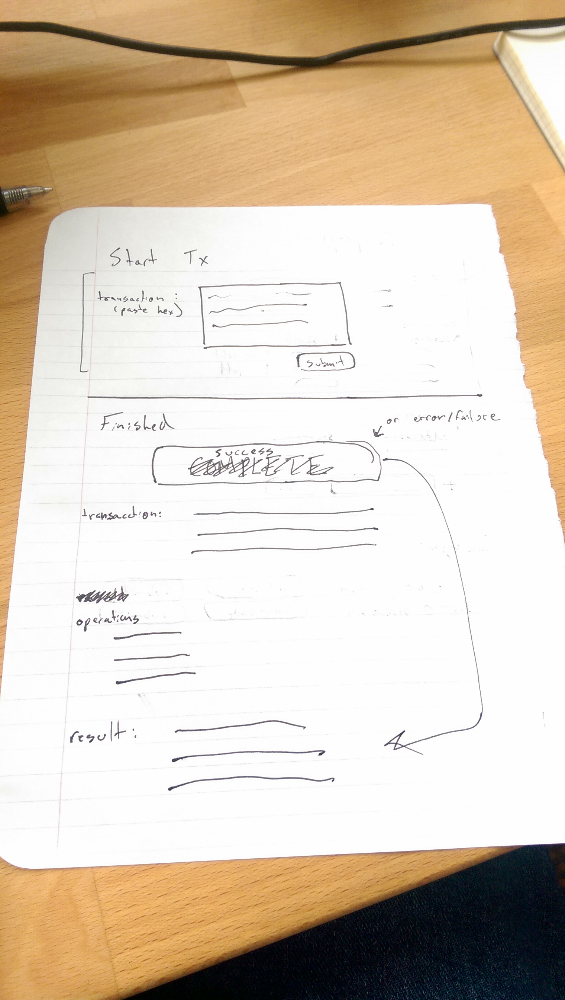
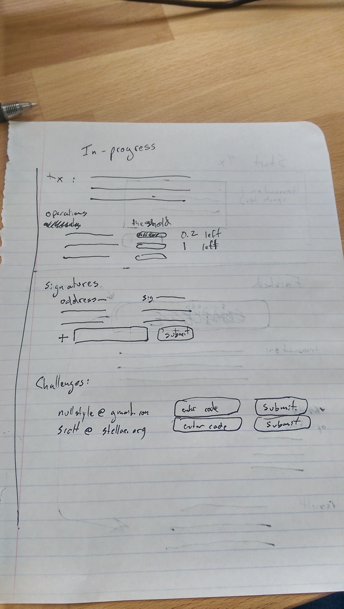

# Stellar Vault

This is a hackday project.  It should not be used in production.  It is a proof of concept.

[Description](https://github.com/stellar/horizon/wiki/Jun-5%2C-2015#stellar-vault)
[Design Notes](https://github.com/stellar/horizon/wiki/Hackday---Stellar-Vault-Design-Notes)

## Setup

1.  Ensure you have ruby 2.1.2, bundler and rake installed
2.  Run `rake install`

## Dev server

Run `rake dev`

## Dev console

Run `rake pry`

## Milestones

- [x]  Can submit transactions sans signatures: they get saved to db
- [ ]  Can add signatures, can manually trigger submission
- [ ]  Can detect when a transaction has enough signatures, automatically submit when it does
- [ ]  Can add keys, which get encrypted. signatures are automatically applied without challenge
- [ ]  Add email-based challenges to keys

## Design Images

